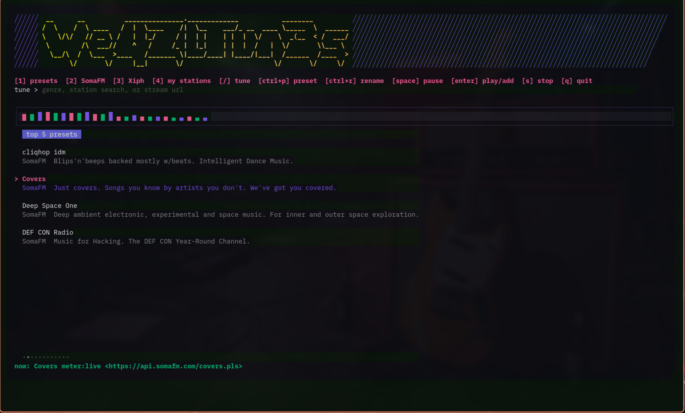

# WeazlTunes



```text
 __      __          _______________._____________           ________         
/  \    /  \ ____   /  |  \____    /|  \__    ___/_ __  ____ \_____  \  ______
\   \/\/   // __ \ /   |  |_/     / |  | |    | |  |  \/    \  _(__  < /  ___/
 \        /\  ___//    ^   /     /_ |  |_|    | |  |  /   |  \/       \\___ \ 
  \__/\  /  \___  >____   /_______ \|____/____| |____/|___|  /______  /____  >
       \/       \/     |__|       \/                       \/       \/     \/ 
```

A terminal radio tuner for long nights at the keyboard. WeazlTunes is built for
a machine that still feels like yours, tuned into the older, stranger web. No
browser tabs, no bloated web players, and absolutely zero algorithmic sludge
telling you what to listen to.

Just Icecast streams, SomaFM, and whatever weird little URL you pulled from a
2:13 AM internet rabbit hole. WeazlTunes is the dial. `mpv` is the amp.

## Defaults

On first boot, WeazlTunes drops a fresh `config.json` into
`~/.config/weazltunes/` pre-loaded with five SomaFM stations:

- Groove Salad
- Drone Zone
- DEF CON Radio
- Indie Pop Rocks
- Deep Space One

It is a curated survival kit from 56k modems, Crystal Pepsi, and internet
handles, ready to play before you even touch a config file.

Custom URLs land under `my_stations`. Presets are strictly limited to eight
quick slots. No infinite scrolling, no AI DJ. Just eight hard buttons like an
old car radio. Promoted stations jump to the top, and `[` / `]` let you rewire
the order so your hands know exactly where the buttons are without looking.

## Grab The Source

```sh
go run ./cmd/weazltunes
```

## Install Script

```sh
./scripts/install.sh
```

No wizards. No corporate installers. The script handles the chores: it builds
`weazltunes`, tucks it into `~/.weazltunes/bin`, and adds that directory to your
shell `PATH`. It uses local Go caches, checks your version against `go.mod`, and
warns if `mpv` is not installed.

Set `WEAZLTUNES_SKIP_LAUNCH=1` to run the setup script without automatically
jacking into the UI:

```sh
WEAZLTUNES_SKIP_LAUNCH=1 ./scripts/install.sh
```

## Requirements And The Stack

- Go 1.25 or newer
- `mpv` in `PATH`
- `ffmpeg` in `PATH` for the visualizer

WeazlTunes is the tuner; `mpv` is the heavy lifting. If your local `mpv` build
can handle MP3, AAC, Ogg, playlist URLs, or YouTube live streams, WeazlTunes can
play them.

`ffmpeg` is the meter. WeazlTunes uses it to quietly decode a mono copy of the
active stream and feed frequency-band energy straight into the terminal bar
visualizer.

## Build From Source

```sh
go build -o weazltunes ./cmd/weazltunes
```

Pure Go. No CGO yak-shaving, no databases, and no native extension puzzle box.
If Go can build Bubble Tea apps on your metal, it can build this.

## The Command Deck

- `1`: top eight presets
- `2`: SomaFM directory
- `3`: Xiph/Icecast search mode
- `4`: my stations
- `/`: focus the tune box
- `enter`: search, play selected station, or save/play a pasted URL
- `ctrl+p`: promote pasted, selected, or playing station to the eight preset slots
- `ctrl+r`: rename selected preset or saved station
- `ctrl+d`: delete selected preset or saved station
- `[` / `]`: move selected preset or saved station up/down
- `space`: pause/resume playback
- `s`: stop playback
- `esc`: leave the tune box; it does not quit the app
- `q` / `ctrl+c`: quit the app

## Tuning And Directories

Drop a direct stream URL into the tune box and press `enter`:

```text
https://example.com/stream.mp3
```

It instantly saves to `my_stations` and fires up.

Here is the other useful trick: paste a YouTube Live URL. Opening a browser tab
just to listen to a 24/7 synthwave stream or a launch countdown is a waste of
RAM. Paste that YouTube link into WeazlTunes. If your local `mpv` can resolve
it, WeazlTunes pipes the audio through without dragging a browser along for the
ride.

Press `ctrl+p` to promote a station when it earns one of your eight preset
slots. Duplicate URLs are folded together so you do not end up with mystery
mixtape clutter.

SomaFM is pulled fresh from:

```text
https://api.somafm.com/channels.json
```

Xiph search reads the public Icecast directory, hitting genre pages first and
then falling back to the raw XML feed for broad text matching.

## Visuals

Neon soul on dark panels. The colors are inverted from WeazlChat: a yellow
wordmark, purple diagonal rails, and mint status text.

The visualizer uses Harmonica to render reactive bars driven by the `ffmpeg`
stream decode, log-spaced from a muddy 20 Hz on the left to a screaming 18 kHz
on the right. If a weird URL prevents the meter from starting, playback keeps
running and the bars gracefully degrade to synthetic motion to keep the screen
alive.

## Config

Edit `~/.config/weazltunes/config.json` when you want to manipulate the bare
metal:

```json
{
  "presets": [
    {
      "name": "Late Night Stream",
      "url": "https://example.com/stream.mp3"
    }
  ],
  "my_stations": []
}
```

We keep the file strictly human-readable because setting a radio preset should
not require a migration ceremony.
